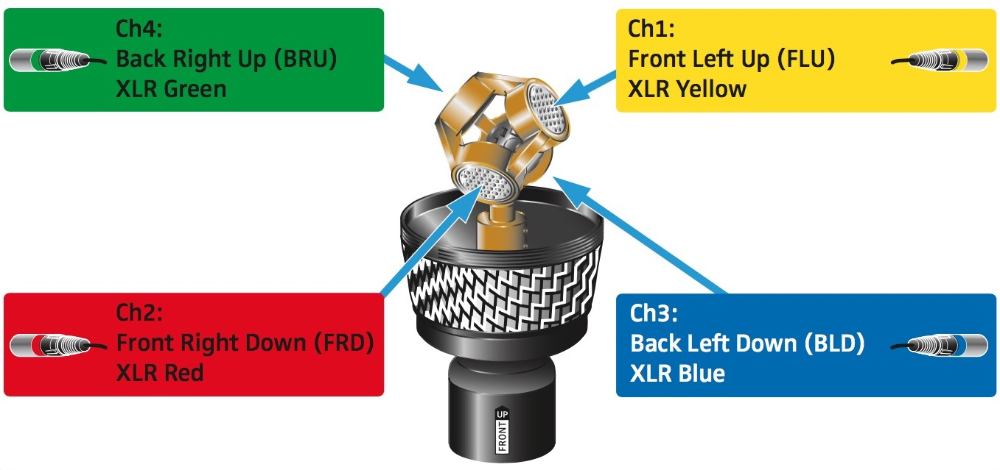
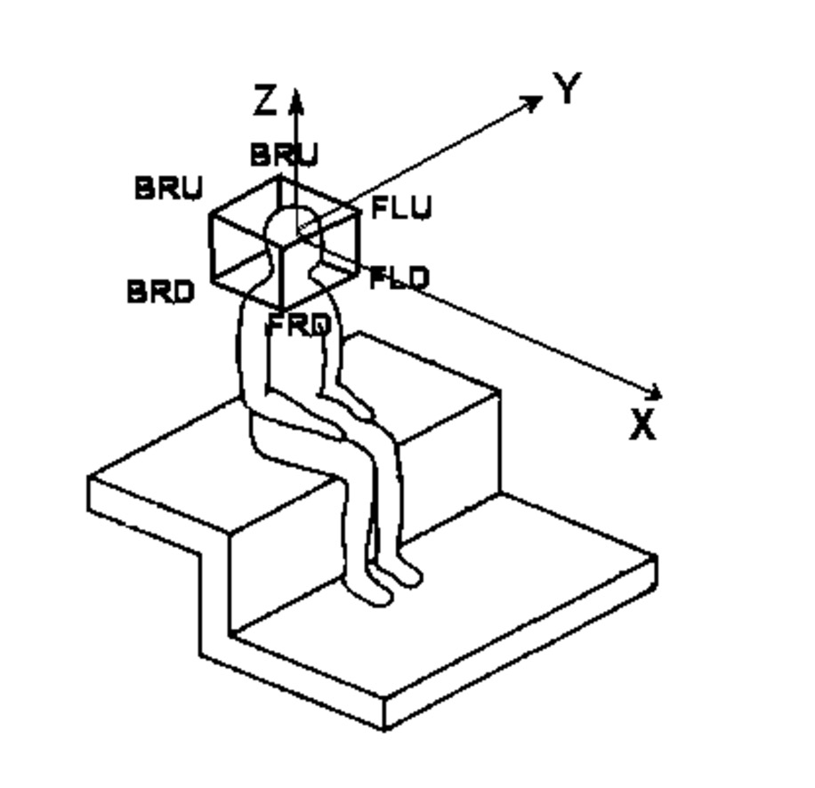

# foa_a2b_encoder
GUI in Matlab for encoding soundfield recordings

# why
Allows you to encode the soundfield outside a DAW. B-format files can then be used in Unity or WebAudio experiences. No more routing or unnecessary sessions.

If you have Octave I believe the script without the GUI will still work.

# reference images

# issues
* no equalization filters implemented yet
* error check for 4 track import failed, was commented out
* error occurs when closing import window before loading file
* normalization uncertainty
* the GUI order is wrong with the buttons, it should be FLU-1, FRD-2, BLD-3, BRU-4. Double check that the encoder script takes the files in the same order.

# ordering
* ACN = [W Y Z X]
* FuMa = [W X Y Z]

# refs
* http://pcfarina.eng.unipr.it/Public/B-format/A2B-conversion/A2B.htm
* https://cycling74.com/forums/ambisonics-methods-for-encoding-a-format-to-b-format
* https://ccrma.stanford.edu/software/openmixer/manual/ambisonics_mode
